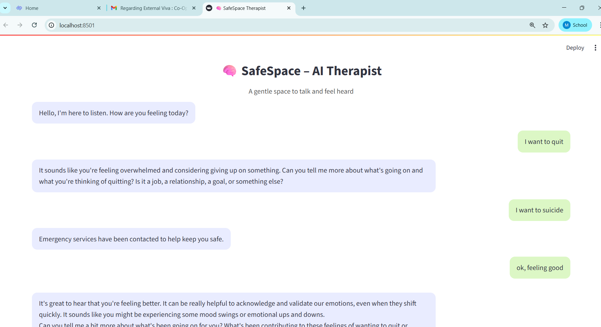
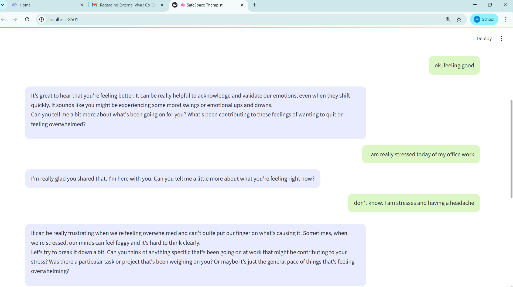
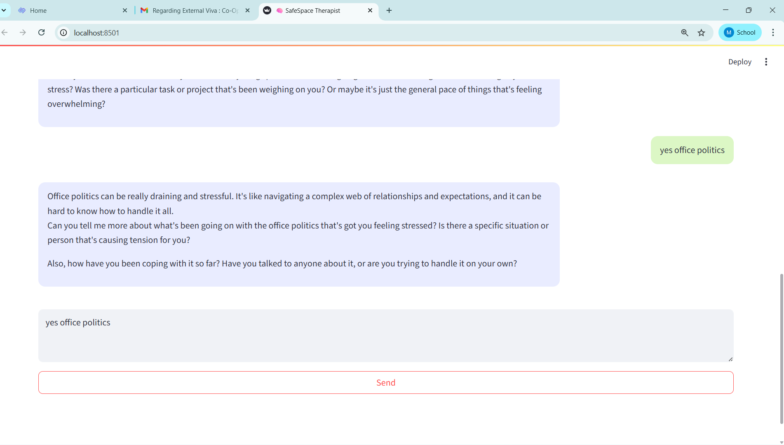

# 🧠 SafeSpace AI Mental Health Therapist

> Your compassionate AI-powered mental health companion for emotional support, crisis detection, and empathetic conversations.


---

## 🌟 Overview

SafeSpace is an AI-powered mental health therapist designed to provide emotional support through intelligent, empathetic conversations.

The system uses AI agent architecture and healthcare-focused models to:

* Understand emotional context
* Detect crisis situations
* Respond empathetically
* Escalate emergencies when needed

In critical situations, SafeSpace can trigger emergency communication workflows using Twilio integration.

---

## ✨ Features

✅ AI-powered empathetic conversations
✅ Mental health support assistant
✅ Crisis & emergency detection
✅ Emergency calling support with Twilio
✅ Streamlit-based modern UI
✅ AI Agent architecture
✅ Fast and lightweight setup using UV
✅ Secure API key handling with `.env`

---
## 🖼️ Project Screenshots

### 💬 Chat Interface



---

### 🚨 Emergency Detection System



---

### 🧠 AI Therapist Conversation



---

## 🛠️ Tech Stack

| Technology | Purpose                   |
| ---------- | ------------------------- |
| Python     | Backend Development       |
| Streamlit  | Frontend/UI               |
| Twilio     | Emergency Communication   |
| UV         | Dependency Management     |
| AI Agents  | Conversation Intelligence |
| MedGemma   | Healthcare-focused AI     |

---

## 📂 Project Structure

```bash
safespace-ai-mental-therapist/
│
├── backend/
│   ├── ai_agent.py
│   ├── config.py
│   ├── tools.py
│   └── main.py
│
├── frontend.py
├── main.py
├── README.md
├── pyproject.toml
└── uv.lock
```

---

# 🚀 Quick Start

## 1️⃣ Clone Repository

```bash
git clone https://github.com/aki011/safespace-ai-mental-therapist.git
cd safespace-ai-mental-therapist
```

---

## 2️⃣ Install UV

Install UV if not already installed:

https://www.youtube.com/watch?v=Dgf7Lp0B_hI

---

## 3️⃣ Setup Environment

Create `.env` file:

```env
TWILIO_ACCOUNT_SID=your_sid
TWILIO_AUTH_TOKEN=your_token
GROQ_API_KEY=your_key
```

---

## 4️⃣ Install Dependencies

```bash
uv sync
```

This command:

* Creates virtual environment
* Installs dependencies
* Reproduces exact project setup

---

## 5️⃣ Run Backend

```bash
uv run backend/main.py
```

---

## 6️⃣ Run Frontend

Open another terminal:

```bash
uv run streamlit run frontend.py
```

---

# 🔒 Security

Sensitive API keys are stored securely using environment variables and `.env` configuration.

`.env` files are excluded from GitHub using `.gitignore`.

---

# 🎯 Future Improvements

* Voice-based therapy assistant
* Multi-language support
* Emotion detection from voice
* Therapist dashboard
* Conversation memory
* AI journaling system

---

# ⚠️ Disclaimer

This project is designed for educational and supportive purposes only and should not replace professional mental health care or medical advice.

---

# 👨‍💻 Author

### Akshay Makhija

If you like this project, give it a ⭐ on GitHub.
